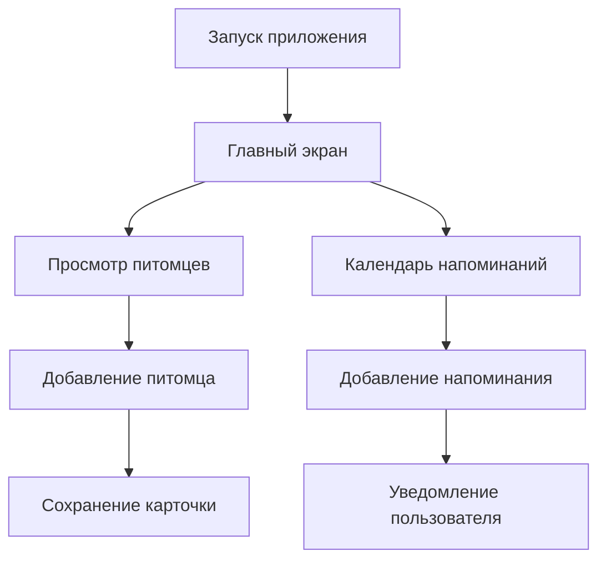

# PupiloPlus Documentation

Добро пожаловать в интерактивную документацию проекта PupiloPlus.

## Назначение документации

Документация предназначена для пользователей мобильного приложения PupiloPlus. Она помогает быстро понять назначение приложения, выполнить установку, начать работу, освоить основные операции и получить справочную информацию по функциям программы.

## Основные возможности

- учет данных о домашних питомцах;
- добавление фото и характеристик животного;
- вычисление возраста по дате рождения;
- создание напоминаний о кормлении, лечении и уходе;
- просмотр событий в календаре;
- настройка уведомлений и темы интерфейса.

## Навигация по документу

- [Главная страница](index.md)
- [Быстрый старт](quick-start.md)
- [Установка и настройка](installation.md)
- [Руководство пользователя](user-guide.md)
- [Справочная информация](reference.md)

## Краткая схема работы

> Для начала работы перейдите к разделу [Быстрый старт](quick-start.md).
