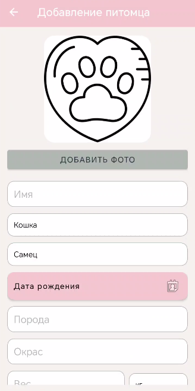
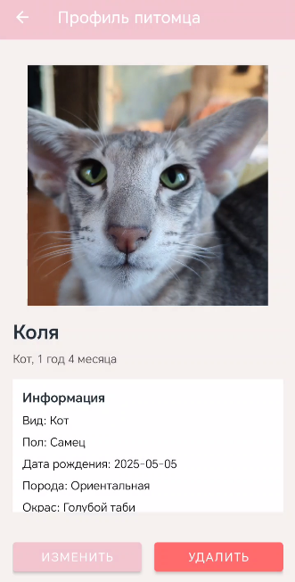
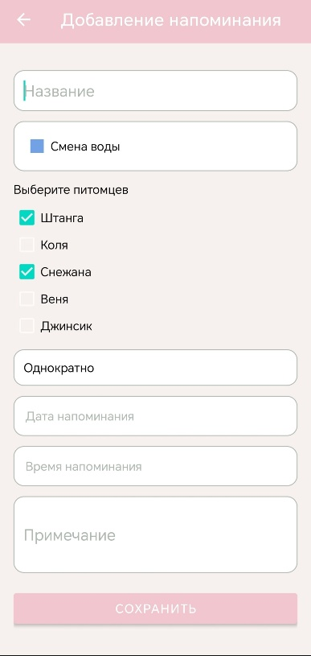
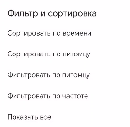
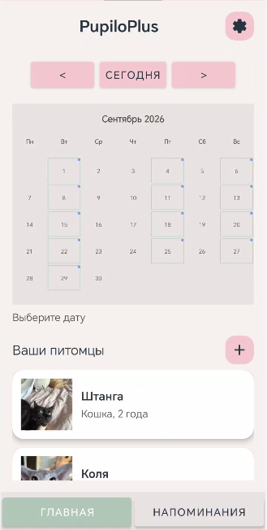
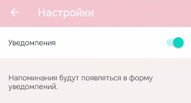
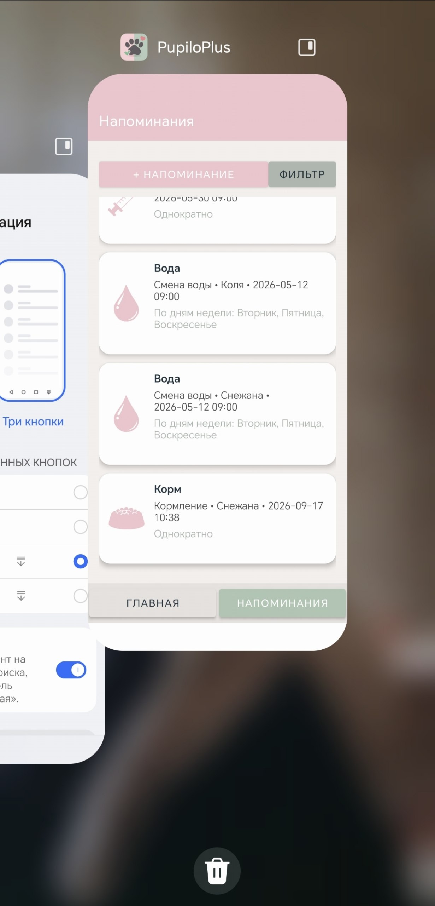

# Руководство пользователя

## Основной сценарий работы

Пользователь может работать с приложением по следующему сценарию:

1. добавить питомца;
2. заполнить его данные;
3. создать напоминания;
4. просмотреть календарь;
5. получать уведомления в назначенные часы.

## Добавление питомца

Чтобы добавить питомца, выполните следующие действия:

- откройте главный экран;
- нажмите кнопку добавления животного;
- заполните имя, тип, пол, дату рождения и дополнительные параметры;
- выберите фото, если это необходимо;
- сохраните данные.

На рисунке показана форма добавления питомца с основными полями: имя, тип, дата рождения и порода.

После сохранения питомец будет отображаться в списке на главной странице.

## Просмотр профиля питомца

Нажмите карточку питомца. Откроется профиль, где можно увидеть:

- имя и тип животного;
- дату рождения;
- возраст;
- массу, породу и дополнительные сведения;
- фото питомца;
- заметки и особенности ухода.

На рисунке отображён профиль питомца, включая фото, возраст и информацию о животном.

## Создание напоминания

В разделе напоминаний можно:

- создавить новое событие;
- указать дату и время;
- выбрать периодичность;
- привязать напоминание к определенному питомцу;
- указать дозировку или дополнительные данные.

На рисунке представлена форма добавления напоминания с выбором питомца, даты и текста уведомления.

## Фильтры и сортировка

В приложении предусмотрены инструменты сортировки и фильтрации напоминаний и данных по питомцам. На рисунке показан экран фильтров и сортировки.

## Уведомления

Пример уведомления отображён на рисунке. В нём пользователь видит информацию о событии, времени и действиях по подтверждению или закрытию напоминания.

## Календарь

Календарь позволяет быстро увидеть, какие даты заняты напоминаниями. Это удобно для планирования ухода и контроля регулярных процедур.

На рисунке показан главный экран с календарём и списком питомцев, поэтому пользователь может быстро оценить текущую загрузку дней.

## Настройки уведомлений

В разделе настроек можно:

- включить или отключить уведомления;
- выбрать текущую тему приложения;
- контролировать поведение уведомлений.

На рисунке изображён экран настроек, на котором можно управлять уведомлениями.

## Завершение работы приложения

На рисунке показан экран завершения работы приложения: пользователь может корректно завершить сеанс или выйти из интерфейса после завершения действий.

## Типичные ситуации

### Если питомец добавлен неправильно

Используйте режим редактирования, чтобы исправить карточку и сохранить актуальные данные.

### Если напоминание не пришло

Проверьте дату, время и разрешения, а также наличие включенного режима уведомлений.

---

[Главная](index.md) | [Быстрый старт](quick-start.md) | [Справочная информация](reference.md)
